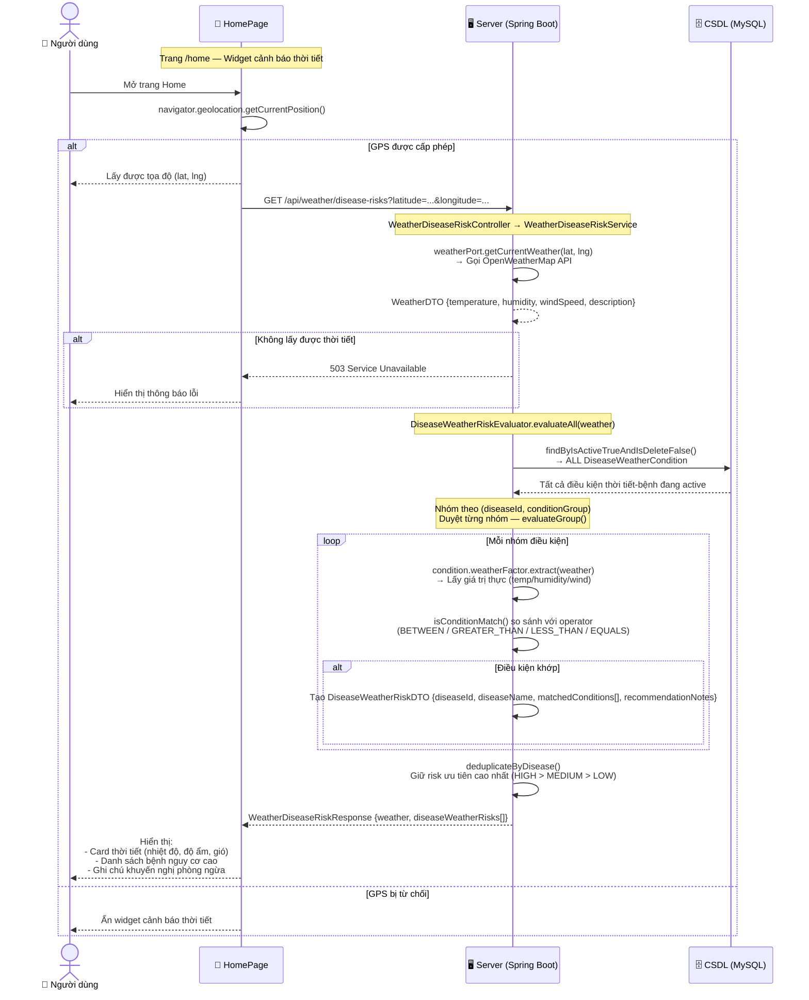
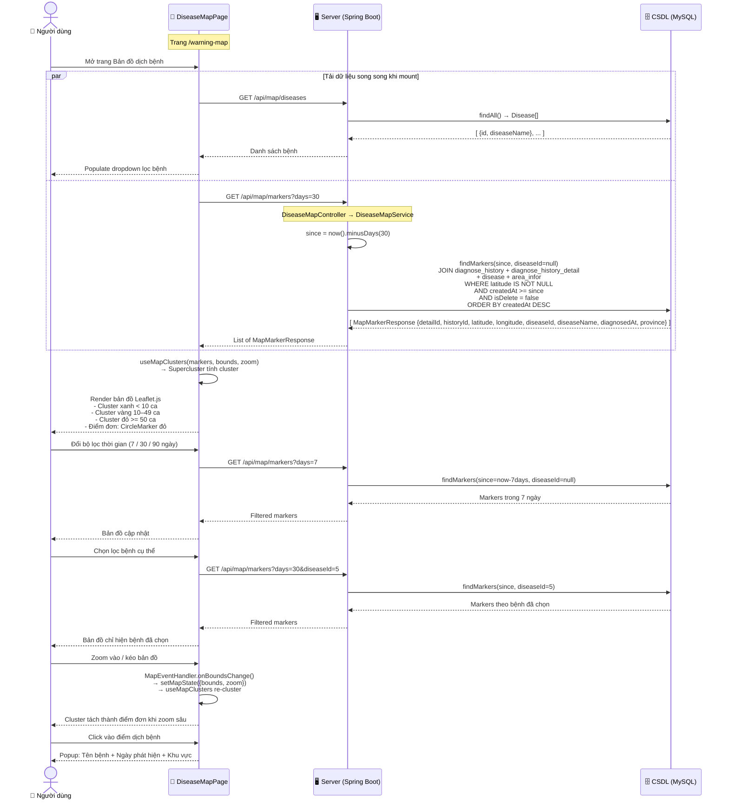

# Biểu đồ tuần tự — AgriAI 3 Chức năng chính

> Đọc từ codebase thực tế · 4 lane: **Người dùng | Giao diện (trang React) | Server (Spring Boot) | CSDL (MySQL)**

---

## 1. Chức năng Chẩn đoán Bệnh

**Trang:** `DiagnosisPage.jsx` → **API:** `POST /api/diagnosis` → **Service:** `DiagnoseService`

```mermaid
sequenceDiagram
    autonumber
    actor User as Người dùng
    participant UI as DiagnosisPage (React View)
    participant API as DiagnoseController / CropTypeController
    participant Service as DiagnoseService
    participant Third as Third-party service
    database DB as Cơ sở dữ liệu

    User->>UI: Mở trang chẩn đoán bệnh
    UI->>API: GET /api/crop-types
    API->>Service: getAvailableCropTypes()
    Service->>DB: findByIsActiveTrueAndIsDeleteFalse()
    DB-->>Service: Danh sách loại cây
    Service-->>API: CropTypeResponse[]
    API-->>UI: Danh sách loại cây
    UI-->>User: Hiển thị form chẩn đoán và dropdown loại cây

    UI->>User: Xin quyền truy cập vị trí
    alt Người dùng cấp quyền vị trí
        User-->>UI: Cho phép truy cập vị trí
        UI->>UI: Lưu tọa độ hiện tại
    else Người dùng từ chối vị trí
        User-->>UI: Từ chối truy cập vị trí
        UI-->>User: Hiển thị trạng thái không có vị trí
    end

    User->>UI: Chọn loại cây và tải ảnh lá
    UI-->>User: Hiển thị ảnh xem trước
    User->>UI: Nhấn nút chẩn đoán

    alt Thiếu loại cây hoặc ảnh
        UI-->>User: Hiển thị lỗi nhập liệu
    else Dữ liệu hợp lệ
        UI->>API: POST /api/diagnosis (multipart/form-data)
        API->>Service: diagnose(email, request)
        Service->>DB: Kiểm tra cropType và user nếu có
        DB-->>Service: CropType và user hợp lệ

        alt Người dùng đã đăng nhập
            Service->>DB: Tạo lịch sử chẩn đoán PENDING
            DB-->>Service: historyId
        end

        Service->>Third: Upload ảnh lên Cloudinary
        Third-->>Service: imageUrl

        par Nhận diện bệnh và lấy thời tiết
            Service->>Third: Gọi Vision AI detect(imageUrl)
            Third-->>Service: Kết quả nhận diện bệnh
        and Có vị trí GPS
            Service->>Third: Gọi OpenWeatherMap current weather
            Third-->>Service: Dữ liệu thời tiết hiện tại
        end

        Service->>Service: Phân tích kết quả AI
        Service->>DB: Tìm thông tin bệnh theo nhãn AI
        DB-->>Service: Disease entity nếu khớp

        alt Phát hiện bệnh
            Service->>DB: Lấy phác đồ xử lý, thuốc, tương tác thuốc, điều kiện thời tiết
            DB-->>Service: Dữ liệu điều trị và cảnh báo
            Service->>Service: Xếp hạng phác đồ và tạo hướng dẫn xử lý
        else Không phát hiện được bệnh
            Service->>Service: Tạo kết quả khỏe/không xác định
        end

        Service->>Third: Gọi Gemini tạo hướng dẫn canh tác
        Third-->>Service: Hướng dẫn AI hoặc fallback nội bộ

        alt Người dùng đã đăng nhập
            Service->>DB: Cập nhật lịch sử và lưu chi tiết kết quả
            DB-->>Service: Xác nhận lưu thành công
            opt Có vị trí GPS
                Service->>Third: Gọi Nominatim reverse geocode
                Third-->>Service: Địa danh/khu vực
                Service->>DB: Lưu/cập nhật thông tin khu vực
                DB-->>Service: Xác nhận cập nhật khu vực
            end
        end

        Service-->>API: DiagnoseResponse
        API-->>UI: Kết quả chẩn đoán
        UI-->>User: Hiển thị bệnh, độ tin cậy, thời tiết, phác đồ, cảnh báo và hướng dẫn
    end
```

---

## 2. Chức năng Cảnh báo Bệnh theo Thời tiết

**Trang:** `HomePage.jsx` (widget thời tiết) → **API:** `GET /api/weather/disease-risks` → **Service:** `WeatherDiseaseRiskService`

> **Lưu ý:** `NotificationsPage.jsx` hiện dùng dummy data (mock). Flow này mô tả API thực tế đang hoạt động.



---

## 3. Chức năng Bản đồ Dịch bệnh

**Trang:** `DiseaseMapPage.jsx` → **API:** `GET /api/map/markers` + `GET /api/map/diseases` → **Service:** `DiseaseMapService`



---

## Tóm tắt luồng dữ liệu

| Chức năng | Endpoint | DB Tables chính | External API |
|-----------|----------|-----------------|--------------|
| **Chẩn đoán bệnh** | `POST /api/diagnosis` | `diagnose_history`, `diagnose_history_detail`, `diagnose_treatment_recommendation`, `disease`, `treatment_plan`, `drug_interaction` | Cloudinary, AI Model (YOLO), OpenWeatherMap, Nominatim |
| **Cảnh báo thời tiết** | `GET /api/weather/disease-risks` | `disease_weather_condition`, `disease` | OpenWeatherMap |
| **Bản đồ dịch bệnh** | `GET /api/map/markers` | `diagnose_history`, `diagnose_history_detail`, `disease`, `area_infor` | OpenStreetMap (Leaflet tiles) |

> **Ghi chú:** Dữ liệu bản đồ được sinh tự động từ lịch sử chẩn đoán có GPS — mỗi lần nông dân chẩn đoán thành công với tọa độ, điểm đó xuất hiện trên bản đồ dịch bệnh cộng đồng.
