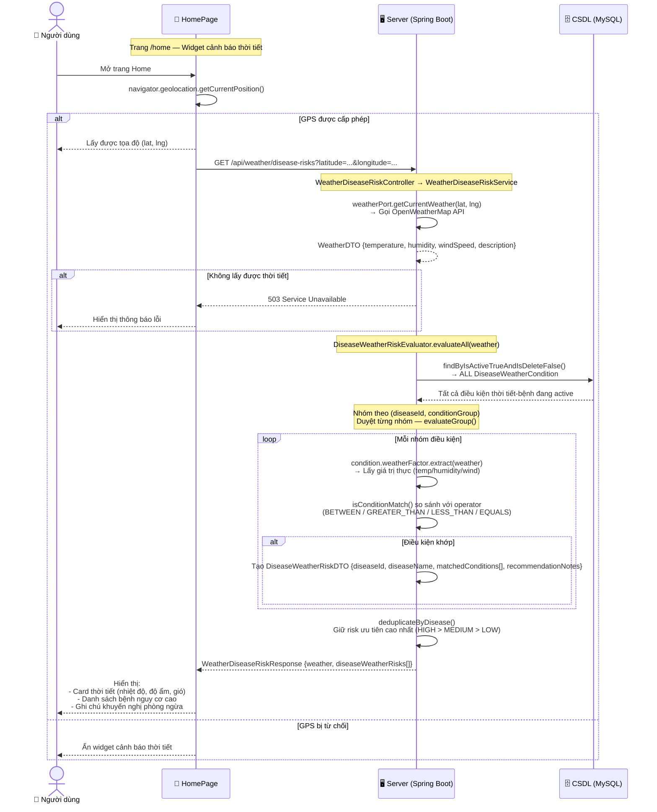
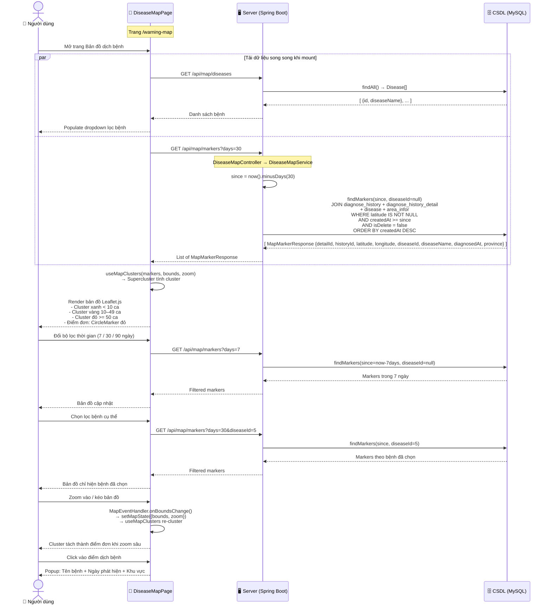

# Biểu đồ tuần tự — AgriAI 3 Chức năng chính

> Đọc từ codebase thực tế · 4 lane: **Người dùng | Giao diện (trang React) | Server (Spring Boot) | CSDL (MySQL)**

---

## 1. Chức năng Chẩn đoán Bệnh

**Trang:** `DiagnosisPage.jsx` → **API:** `POST /api/diagnosis` → **Service:** `DiagnoseService`

```mermaid
sequenceDiagram
    actor User as 👤 Người dùng
    participant UI as 📱 DiagnosisPage
    participant Server as 🖥️ Server (Spring Boot)
    participant DB as 🗄️ CSDL (MySQL)

    Note over UI: Trang /diagnosis

    User->>UI: Mở trang chẩn đoán
    UI->>Server: GET /api/crop-types
    Server->>DB: findAll() CropType (is_active=true)
    DB-->>Server: Danh sách loại cây trồng
    Server-->>UI: [ {id, cropName}, ... ]
    UI-->>User: Hiển thị dropdown chọn loại cây

    User->>UI: Cấp quyền GPS (navigator.geolocation)
    UI-->>User: GPS granted → hiển thị badge "GPS bật"

    User->>UI: Chọn loại cây + upload ảnh lá
    UI-->>User: Preview ảnh hiển thị

    User->>UI: Nhấn "Chẩn đoán ngay"
    UI->>UI: Validate: ảnh & cropTypeId required

    UI->>Server: POST /api/diagnosis (multipart/form-data)<br/>{image, cropTypeId, latitude?, longitude?}

    Note over Server: DiagnoseController → DiagnoseService

    Server->>DB: findById(cropTypeId) → CropType
    DB-->>Server: CropType entity
    Server->>DB: findByEmail(principal) → User (nếu đã login)
    DB-->>Server: User entity (hoặc null nếu guest)

    alt Người dùng đã đăng nhập
        Server->>DB: INSERT diagnose_history (status=PENDING)
        DB-->>Server: history.id
    end

    Note over Server: Parallel Async (CompletableFuture)

    par Upload ảnh song song với fetch thời tiết
        Server->>Server: imageStoragePort.upload(image) → Cloudinary
        Server-->>Server: imageUrl
    and
        alt GPS có tọa độ
            Server->>Server: weatherPort.getCurrentWeather(lat, lng) → OpenWeatherMap API
            Server-->>Server: WeatherDTO {temp, humidity, windSpeed, ...}
        else Không có GPS
            Server-->>Server: weather = null
        end
    end

    Server->>Server: VisionDetectionPort.detect(imageUrl) → AI Model (Python/YOLO)
    Server-->>Server: [ {label, confidence, severity}, ... ]

    Note over Server: analyzeVisionResults()

    alt confidence >= 0.4 và không phải "healthy"
        Server->>DB: findByLabel(label) → Disease
        DB-->>Server: Disease entity
        Note over Server: DetectedDiseaseMatch list
    end

    alt Phát hiện bệnh
        Server->>DB: findByDiseaseIds() → TreatmentPlan list
        DB-->>Server: Danh sách phác đồ điều trị

        Server->>Server: TreatmentRankingService.rankPlans() → Sắp xếp theo điểm
        Server->>DB: findInteractions() → DrugInteraction
        DB-->>Server: Cảnh báo tương tác thuốc

        Server->>DB: findWeatherConditions(diseaseIds) → DiseaseWeatherCondition
        DB-->>Server: Điều kiện thời tiết → evaluate risk
    end

    Server->>Server: GuidancePort.generateGuidance() → AI sinh hướng dẫn canh tác

    alt Người dùng đã đăng nhập
        Server->>DB: UPDATE diagnose_history (imageUrl, weatherData, status=COMPLETED)
        Server->>DB: INSERT diagnose_history_detail (disease, confidence, severity, treatmentData)
        Server->>DB: INSERT diagnose_treatment_recommendation (treatmentPlan, rankScore)

        Note over Server: Async background
        Server->>Server: GeocodingService.processGeocoding(lat, lng) → Nominatim API
        Server->>DB: UPDATE area_infor (province, district)
    end

    Server-->>UI: DiagnoseResponse {<br/>  diagnosisType, weather,<br/>  treatments[], sprayPrograms[],<br/>  interactionWarnings[], diseaseWeatherRisks[],<br/>  userGuidance, warnings[]<br/>}

    UI-->>User: Hiển thị kết quả:<br/>- Loại bệnh + độ tin cậy<br/>- Thẻ thời tiết<br/>- Phác đồ điều trị<br/>- Cảnh báo tương tác thuốc<br/>- Hướng dẫn AI

    alt Guest user
        UI-->>User: Toast "Đăng nhập để xem lại kết quả"
    end

    opt Đánh giá kết quả
        User->>UI: Nhấn "Đánh giá kết quả chẩn đoán"
        UI-->>User: Mở DiagnosisRatingModal
        User->>UI: Chọn sao + gửi đánh giá
        UI->>Server: POST /api/diagnosis-reviews/{historyId}
        Server->>DB: INSERT diagnose_review
        DB-->>Server: OK
        Server-->>UI: 200 OK
        UI-->>User: Toast "Cảm ơn bạn đã đánh giá!"
    end
```

---

## 2. Chức năng Cảnh báo Bệnh theo Thời tiết

**Trang:** `HomePage.jsx` (widget thời tiết) → **API:** `GET /api/weather/disease-risks` → **Service:** `WeatherDiseaseRiskService`

> **Lưu ý:** `NotificationsPage.jsx` hiện dùng dummy data (mock). Flow này mô tả API thực tế đang hoạt động.

---

## 3. Chức năng Bản đồ Dịch bệnh

**Trang:** `DiseaseMapPage.jsx` → **API:** `GET /api/map/markers` + `GET /api/map/diseases` → **Service:** `DiseaseMapService`

---

## Tóm tắt luồng dữ liệu

| Chức năng | Endpoint | DB Tables chính | External API |
|-----------|----------|-----------------|--------------|
| **Chẩn đoán bệnh** | `POST /api/diagnosis` | `diagnose_history`, `diagnose_history_detail`, `diagnose_treatment_recommendation`, `disease`, `treatment_plan`, `drug_interaction` | Cloudinary, AI Model (YOLO), OpenWeatherMap, Nominatim |
| **Cảnh báo thời tiết** | `GET /api/weather/disease-risks` | `disease_weather_condition`, `disease` | OpenWeatherMap |
| **Bản đồ dịch bệnh** | `GET /api/map/markers` | `diagnose_history`, `diagnose_history_detail`, `disease`, `area_infor` | OpenStreetMap (Leaflet tiles) |

> **Ghi chú:** Dữ liệu bản đồ được sinh tự động từ lịch sử chẩn đoán có GPS — mỗi lần nông dân chẩn đoán thành công với tọa độ, điểm đó xuất hiện trên bản đồ dịch bệnh cộng đồng.
