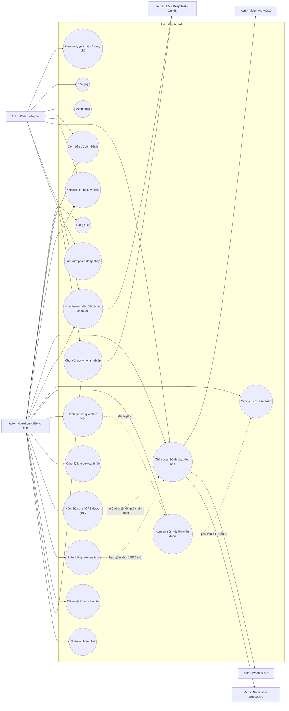
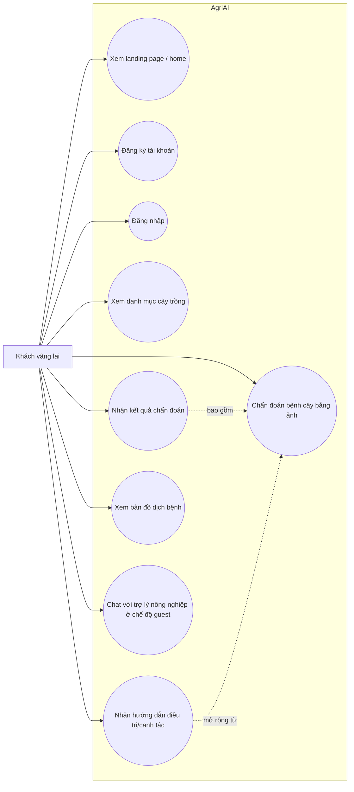
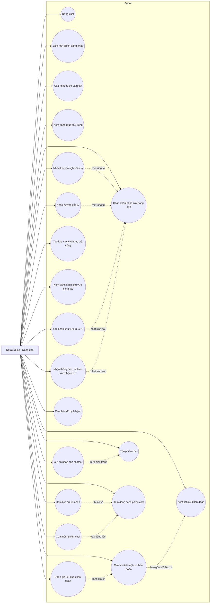
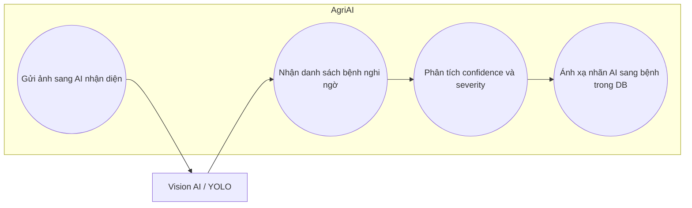
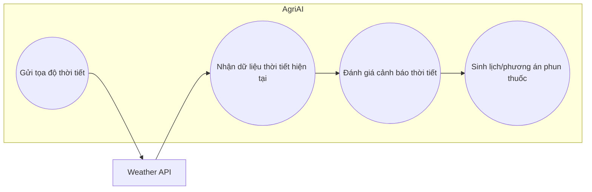
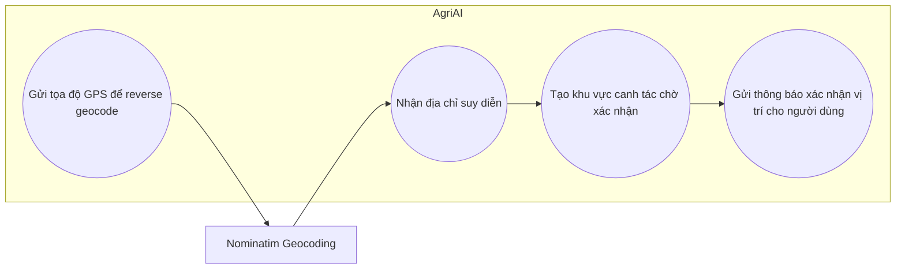
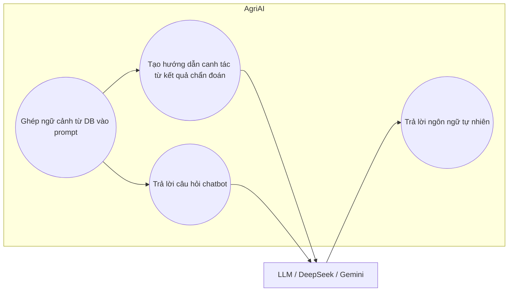

# Biểu đồ Use Case AgriAI

## Phạm vi hệ thống

Tài liệu này được rút ra từ code hiện có trong:

- Backend Spring Boot: `agriai_backend/agriai`
- Frontend React: `agriai_frontend`
- Tài liệu phân tích nghiệp vụ trong `codebase-analysis`

Ghi chú:

- Hệ thống hiện không thấy luồng quản trị viên riêng biệt trong code.
- Chatbot đã có backend thật, không còn chỉ là mock.
- Notification bền vững trong DB chưa hoàn chỉnh; luồng đang chạy thực tế là thông báo realtime xác nhận vị trí.

## 1. Biểu đồ use case tổng quát

## 2. Biểu đồ use case theo từng actor

### 2.1. Actor: Khách vãng lai

### 2.2. Actor: Người dùng/Nông dân đã đăng nhập

### 2.3. Actor: Vision AI / YOLO

### 2.4. Actor: Weather API

### 2.5. Actor: Nominatim Geocoding

### 2.6. Actor: LLM / DeepSeek / Gemini

## 3. Danh sách actor được xác định từ code

- Khách vãng lai
- Người dùng/Nông dân đã đăng nhập
- Vision AI / YOLO service
- Weather API
- Nominatim Geocoding service
- LLM service cho guidance và chatbot

## 4. Các use case chính rút ra từ dự án

- Xác thực người dùng: đăng ký, đăng nhập, làm mới token, đăng xuất
- Chẩn đoán bệnh cây bằng ảnh
- Lấy danh mục cây trồng
- Xem lịch sử và chi tiết chẩn đoán
- Đánh giá kết quả chẩn đoán
- Quản lý khu vực canh tác
- Nhận và xác nhận gợi ý vị trí GPS
- Xem bản đồ dịch bệnh
- Chatbot nông nghiệp
- Cập nhật hồ sơ người dùng
